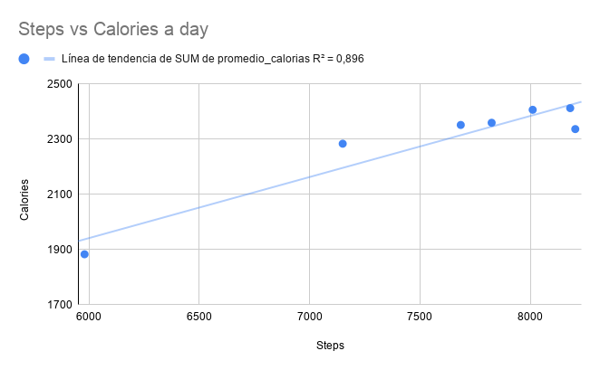

# Smart Device Behavioral Analysis for Women’s Health Tech
**Executive Data Analysis Report — Bellabeat Case Study**

**Prepared for:** Executive Leadership and Marketing Team at Bellabeat  
**Project:** Google Data Analytics Capstone — Smart Device Usage Habits Analysis  
**Tools Used:** Google BigQuery (SQL), Google Sheets (Statistical Analysis), and Looker Studio  

---

## 📌 Executive Summary

This study analyzes the activity, sedentary behavior, and sleep data of smart fitness tracker users to identify key behavioral patterns. Through processing and statistical evaluation of the data, it was determined that walking is the primary driver of daily caloric expenditure (explaining nearly 90% of the variance in energy consumption) and that more than half of the female users exhibit activity levels below international health recommendations.

Based on these findings, a strategy is proposed targeting feature development across the Bellabeat App and devices (Leaf, Time, Ivy), focusing on gamified walking incentives, smart sedentary reminders, and specific challenges to overcome lower physical performance days.

---

## 🏢 Business Context & Problem

Bellabeat is a high-tech, women-oriented health company that manufactures smart fitness tracking devices. To position itself as a key player in the global wellness market, executive management needs to understand how consumers use non-Bellabeat smart devices (Fitbit data) and apply these insights to the brand's marketing and product strategy.

### Key Business Questions
1. What are the main usage trends in smart fitness devices?
2. How do these trends apply to Bellabeat customers?
3. How can these trends help influence Bellabeat’s marketing strategy?

---

## 🛠️ Tools & Methodology

* **Data Processing & Cleaning:** Google BigQuery (SQL) — Applied `PARSE_TIMESTAMP` and CTEs to aggregate 34 unique users' activity and sleep data into a unified dataset (`bellabeat_daily_clean`).
* **Statistical Evaluation:** Google Sheets — Conducted correlation (r) and regression (R2) analysis on activity metrics.
* **Data Visualization:** Looker Studio — Created dual-axis charts, scatter plots, and distribution models.

---

## 📊 Key Visualizations & Findings

### 1. Daily Steps vs. Caloric Expenditure Analysis

<p align="center">
  
</p>

> **Key Analytical Insights:**
> * **Statistical Correlation:** A Pearson correlation coefficient of r=0.946 and coefficient of determination of R2=0.896 confirm that **89.6% of daily caloric variance** is directly explained by total step count.
> * **The "Tuesday Slump":** Activity and caloric expenditure drop significantly on Tuesdays (averaging **5,980 steps** and **1,882 kcal**), contrasting with Saturday peaks (**8,181 steps** and **2,412 kcal**).

---

### 2. User Activity Segmentation (CDC / WHO Benchmarks)

Analyzing average daily step counts per user reveals a significant sedentary skew across the sample:

| Activity Category | Criteria (Daily Steps) | User Count | Percentage |
| :--- | :---: | :---: | :---: |
| **Sedentary** | < 5,000 steps | 12 | **35.3%** |
| **Lightly Active** | 5,000 – 7,499 steps | 6 | **17.6%** |
| **Moderately Active** | 7,500 – 9,999 steps | 8 | **23.5%** |
| **Very Active** | $\ge$ 10,000 steps | 8 | **23.5%** |

* **Summary:** **52.9%** of monitored users average fewer than 7,500 steps per day, highlighting a massive opportunity for user engagement and habit building.

---

## 🚀 Strategic Recommendations for Bellabeat

1. **Gamified Step Incentive Program ("Bellabeat Points")**
   * **Rationale:** Step count directly drives energy expenditure, yet 35.3% of users are sedentary.
   * **Action:** Implement a rewards program in the Bellabeat App where daily step achievements earn points redeemable for free Bellabeat Premium subscriptions or discounts on hardware (Leaf, Time, Ivy).

2. **Targeted Campaign for Low-Activity Days ("Tuesday Slump")**
   * **Rationale:** Tuesdays exhibit the lowest step average and caloric burn of the entire week.
   * **Action:** Deploy push notifications offering double-point multipliers on Tuesdays and Thursdays to encourage short 10-to-15-minute walks.

3. **Smart Inactivity Alerts & Wind-Down Reminders**
   * **Rationale:** Users average 15.72 sedentary hours per day.
   * **Action:** Program haptic feedback alerts on Bellabeat wearables following 50 minutes of continuous daytime inactivity, prompting a 250-step walk.

---

## ⚠️ Data Limitations

While the dataset provides valuable insights into general wearable technology usage, several limitations must be acknowledged regarding data integrity and business scope:

* **Small Sample Size:** The dataset contains records from only **30 to 34 unique users** over a 31-day monitoring period (March – May 2016). This small sample limits the statistical power and generalizability of the findings to a broader population.
* **Absence of Demographic Information:** The public Fitbit dataset lacks critical demographic metadata, such as gender, age, geographic location, or health baseline. Because Bellabeat specifically targets female consumers, applying gender-neutral Fitbit data requires caution.
* **Data Freshness / Timeliness:** The dataset was collected in **2016**. Fitness tracker adoption, sensor precision, and consumer habits have evolved significantly over the past decade.
* **Self-Reporting and Sensor Discrepancies:** Inconsistent device-wearing habits (e.g., users removing devices while sleeping or charging) resulted in missing sleep logs for a subset of participants.
* **Lack of Contextual Factors:** External variables such as climate, work schedules, or seasonal changes that could explain daily activity variations (like the "Tuesday Slump") are not recorded in the dataset.

---

## 📁 Repository Structure

```text
Bellabeat-Data-Analysis/
├── README.md                      <-- Main executive summary and report
├── sql/                           <-- BigQuery SQL scripts
│   ├── 01_data_cleaning.sql       <-- Raw table processing & unified view
│   └── 02_exploratory_analysis.sql<-- Weekly averages & segmentation queries
├── reports/                       <-- Documented deliverables
│   └── Executive_Report_Bellabeat.pdf
└── images/                        <-- Visualizations & charts
    └── steps_vs_calories.png
